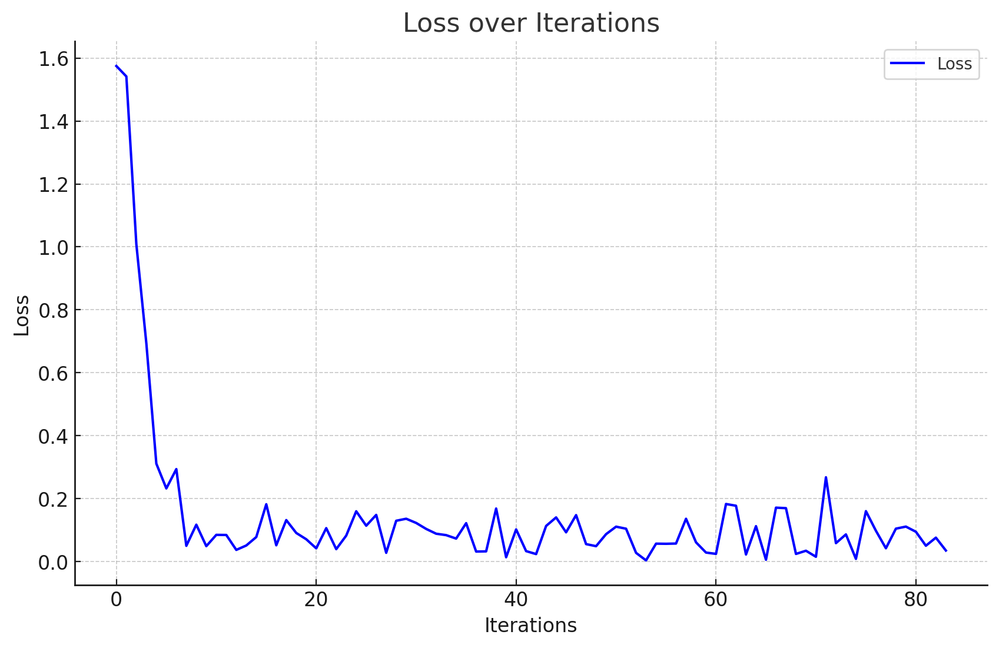

# 实体抽取任务案例
为方便用户快速上手，下面我们准备了一个真实案例来演示如何使用`Hunyuan-A13B`进行精调。
- 基座模型：`Hunyuan-A13B-Instruct`
- 训练数据：约5k条汽车领域的[实体抽取数据](data)
- 训练数据示例如下
```
{"messages": [{"role": "system", "content": "You are a helpful assistant."}, {"role": "user", "content": "/no_think请提取下列文章中包含的车系：\nbilstein evo s,黑黄涂装,比b14更舒适的绞牙避震 | 酷乐汽车\n"}, {"role": "assistant", "content": "<think>\n\n</think>\n<answer>\n无\n</answer>"}]}
```

## 训练
- 训练环境配置可参考 [train/README.md](../train/README.md)
- 训练脚本可参考 [train_demo.sh](train_demo.sh)，需要修改其中的`model_path`、`train_data_file`和`output_path`
- 首次加载模型耗时会较长，成功运行后会打印每个step的loss
```
{'loss': 1.5747, 'grad_norm': 21.998371124267578, 'learning_rate': 5e-06, 'epoch': 0.0}
{'loss': 1.5416, 'grad_norm': 23.807628631591797, 'learning_rate': 1e-05, 'epoch': 0.0}
{'loss': 1.0083, 'grad_norm': 16.515661239624023, 'learning_rate': 9.99943357453244e-06, 'epoch': 0.01}
{'loss': 0.6936, 'grad_norm': 12.658246994018555, 'learning_rate': 9.997734440724333e-06, 'epoch': 0.01}
{'loss': 0.3112, 'grad_norm': 12.144488334655762, 'learning_rate': 9.994903026323537e-06, 'epoch': 0.01}
{'loss': 0.2324, 'grad_norm': 13.540153503417969, 'learning_rate': 9.99094004412348e-06, 'epoch': 0.01}
{'loss': 0.2939, 'grad_norm': 16.390094757080078, 'learning_rate': 9.985846491783742e-06, 'epoch': 0.01}
{'loss': 0.05, 'grad_norm': 5.0997490882873535, 'learning_rate': 9.979623651578881e-06, 'epoch': 0.01}
{'loss': 0.1172, 'grad_norm': 8.534819602966309, 'learning_rate': 9.972273090075644e-06, 'epoch': 0.02}
{'loss': 0.049, 'grad_norm': 7.705018520355225, 'learning_rate': 9.96379665773858e-06, 'epoch': 0.02}
{'loss': 0.0849, 'grad_norm': 4.557572364807129, 'learning_rate': 9.954196488464198e-06, 'epoch': 0.02}
{'loss': 0.0845, 'grad_norm': 4.205256462097168, 'learning_rate': 9.943474999043775e-06, 'epoch': 0.02}
{'loss': 0.0371, 'grad_norm': 4.8200764656066895, 'learning_rate': 9.931634888554937e-06, 'epoch': 0.02}
{'loss': 0.0511, 'grad_norm': 3.4767568111419678, 'learning_rate': 9.91867913768218e-06, 'epoch': 0.02}
{'loss': 0.0779, 'grad_norm': 4.751957893371582, 'learning_rate': 9.904611007966506e-06, 'epoch': 0.03}
{'loss': 0.1822, 'grad_norm': 6.5772199630737305, 'learning_rate': 9.889434040984333e-06, 'epoch': 0.03}
{'loss': 0.0517, 'grad_norm': 3.1723222732543945, 'learning_rate': 9.87315205745594e-06, 'epoch': 0.03}
{'loss': 0.1318, 'grad_norm': 5.595203399658203, 'learning_rate': 9.855769156283604e-06, 'epoch': 0.03}
{'loss': 0.0909, 'grad_norm': 5.5189738273620605, 'learning_rate': 9.837289713519741e-06, 'epoch': 0.03}
{'loss': 0.0709, 'grad_norm': 4.001913070678711, 'learning_rate': 9.81771838126524e-06, 'epoch': 0.03}
{'loss': 0.042, 'grad_norm': 3.1594796180725098, 'learning_rate': 9.797060086498332e-06, 'epoch': 0.04}
{'loss': 0.1062, 'grad_norm': 4.279033184051514, 'learning_rate': 9.775320029834255e-06, 'epoch': 0.04}
{'loss': 0.0395, 'grad_norm': 2.6960699558258057, 'learning_rate': 9.752503684216008e-06, 'epoch': 0.04}
{'loss': 0.0825, 'grad_norm': 5.412889003753662, 'learning_rate': 9.728616793536588e-06, 'epoch': 0.04}
{'loss': 0.1598, 'grad_norm': 8.022457122802734, 'learning_rate': 9.703665371192981e-06, 'epoch': 0.04}
{'loss': 0.1139, 'grad_norm': 5.931814670562744, 'learning_rate': 9.677655698572326e-06, 'epoch': 0.05}
{'loss': 0.1483, 'grad_norm': 4.834787368774414, 'learning_rate': 9.650594323470618e-06, 'epoch': 0.05}
{'loss': 0.0278, 'grad_norm': 2.7010855674743652, 'learning_rate': 9.622488058444313e-06, 'epoch': 0.05}
{'loss': 0.1297, 'grad_norm': 4.512578964233398, 'learning_rate': 9.593343979095334e-06, 'epoch': 0.05}
{'loss': 0.1361, 'grad_norm': 16.87189292907715, 'learning_rate': 9.563169422289798e-06, 'epoch': 0.05}
{'loss': 0.1227, 'grad_norm': 5.438766956329346, 'learning_rate': 9.531971984311011e-06, 'epoch': 0.05}
{'loss': 0.1037, 'grad_norm': 5.51556921005249, 'learning_rate': 9.499759518947156e-06, 'epoch': 0.06}
{'loss': 0.0885, 'grad_norm': 3.038165807723999, 'learning_rate': 9.466540135514119e-06, 'epoch': 0.06}
{'loss': 0.084, 'grad_norm': 2.7842869758605957, 'learning_rate': 9.432322196814032e-06, 'epoch': 0.06}
{'loss': 0.073, 'grad_norm': 2.188586711883545, 'learning_rate': 9.397114317029975e-06, 'epoch': 0.06}
{'loss': 0.122, 'grad_norm': 2.4716217517852783, 'learning_rate': 9.360925359557397e-06, 'epoch': 0.06}
{'loss': 0.0318, 'grad_norm': 1.720734715461731, 'learning_rate': 9.323764434772817e-06, 'epoch': 0.06}
{'loss': 0.0324, 'grad_norm': 1.8834900856018066, 'learning_rate': 9.285640897740316e-06, 'epoch': 0.07}
{'loss': 0.1685, 'grad_norm': 4.6912126541137695, 'learning_rate': 9.246564345856472e-06, 'epoch': 0.07}
{'loss': 0.0137, 'grad_norm': 1.1563652753829956, 'learning_rate': 9.206544616434249e-06, 'epoch': 0.07}
{'loss': 0.1022, 'grad_norm': 4.029001235961914, 'learning_rate': 9.165591784226513e-06, 'epoch': 0.07}
{'loss': 0.0332, 'grad_norm': 2.5403590202331543, 'learning_rate': 9.123716158889765e-06, 'epoch': 0.07}
{'loss': 0.0238, 'grad_norm': 2.3610777854919434, 'learning_rate': 9.080928282388746e-06, 'epoch': 0.07}
{'loss': 0.1132, 'grad_norm': 7.632385730743408, 'learning_rate': 9.037238926342544e-06, 'epoch': 0.08}
{'loss': 0.1403, 'grad_norm': 3.4618217945098877, 'learning_rate': 8.992659089312906e-06, 'epoch': 0.08}
{'loss': 0.0929, 'grad_norm': 3.004936695098877, 'learning_rate': 8.947199994035402e-06, 'epoch': 0.08}
{'loss': 0.1476, 'grad_norm': 3.689244508743286, 'learning_rate': 8.900873084594164e-06, 'epoch': 0.08}
{'loss': 0.0555, 'grad_norm': 2.8474831581115723, 'learning_rate': 8.853690023540898e-06, 'epoch': 0.08}
{'loss': 0.0489, 'grad_norm': 3.2130770683288574, 'learning_rate': 8.805662688958898e-06, 'epoch': 0.09}
{'loss': 0.0871, 'grad_norm': 7.426385879516602, 'learning_rate': 8.756803171472817e-06, 'epoch': 0.09}
{'loss': 0.1109, 'grad_norm': 4.248425483703613, 'learning_rate': 8.707123771204884e-06, 'epoch': 0.09}
{'loss': 0.1044, 'grad_norm': 5.062757968902588, 'learning_rate': 8.656636994678447e-06, 'epoch': 0.09}
{'loss': 0.0277, 'grad_norm': 2.3105485439300537, 'learning_rate': 8.605355551669505e-06, 'epoch': 0.09}
{'loss': 0.0037, 'grad_norm': 0.4513387084007263, 'learning_rate': 8.553292352007096e-06, 'epoch': 0.09}
{'loss': 0.0569, 'grad_norm': 3.4462757110595703, 'learning_rate': 8.500460502323313e-06, 'epoch': 0.1}
{'loss': 0.0565, 'grad_norm': 3.9332664012908936, 'learning_rate': 8.446873302753783e-06, 'epoch': 0.1}
{'loss': 0.0573, 'grad_norm': 3.06567645072937, 'learning_rate': 8.392544243589428e-06, 'epoch': 0.1}
{'loss': 0.136, 'grad_norm': 5.514697551727295, 'learning_rate': 8.337487001880353e-06, 'epoch': 0.1}
{'loss': 0.0611, 'grad_norm': 4.535100936889648, 'learning_rate': 8.281715437992724e-06, 'epoch': 0.1}
{'loss': 0.0286, 'grad_norm': 2.449686050415039, 'learning_rate': 8.225243592119501e-06, 'epoch': 0.1}
{'loss': 0.0244, 'grad_norm': 2.9863641262054443, 'learning_rate': 8.168085680745883e-06, 'epoch': 0.11}
{'loss': 0.1829, 'grad_norm': 4.567348480224609, 'learning_rate': 8.110256093070393e-06, 'epoch': 0.11}
{'loss': 0.1774, 'grad_norm': 3.3676586151123047, 'learning_rate': 8.051769387382468e-06, 'epoch': 0.11}
{'loss': 0.0224, 'grad_norm': 2.034000873565674, 'learning_rate': 7.992640287397498e-06, 'epoch': 0.11}
{'loss': 0.1125, 'grad_norm': 4.06443452835083, 'learning_rate': 7.932883678550191e-06, 'epoch': 0.11}
{'loss': 0.0058, 'grad_norm': 0.5667861700057983, 'learning_rate': 7.872514604247261e-06, 'epoch': 0.11}
{'loss': 0.1713, 'grad_norm': 6.76041316986084, 'learning_rate': 7.81154826208033e-06, 'epoch': 0.12}
{'loss': 0.1697, 'grad_norm': 9.704129219055176, 'learning_rate': 7.75e-06, 'epoch': 0.12}
{'loss': 0.0243, 'grad_norm': 1.464701771736145, 'learning_rate': 7.68788531245211e-06, 'epoch': 0.12}
{'loss': 0.0344, 'grad_norm': 1.792169213294983, 'learning_rate': 7.625219836477073e-06, 'epoch': 0.12}
{'loss': 0.0152, 'grad_norm': 1.6501606702804565, 'learning_rate': 7.562019347773348e-06, 'epoch': 0.12}
{'loss': 0.2678, 'grad_norm': 6.2335286140441895, 'learning_rate': 7.498299756725984e-06, 'epoch': 0.12}
{'loss': 0.0586, 'grad_norm': 3.4284427165985107, 'learning_rate': 7.434077104401274e-06, 'epoch': 0.13}
{'loss': 0.0863, 'grad_norm': 5.665964603424072, 'learning_rate': 7.36936755850849e-06, 'epoch': 0.13}
{'loss': 0.0085, 'grad_norm': 1.3109562397003174, 'learning_rate': 7.3041874093297625e-06, 'epoch': 0.13}
{'loss': 0.1602, 'grad_norm': 6.0413360595703125, 'learning_rate': 7.2385530656190785e-06, 'epoch': 0.13}
{'loss': 0.0979, 'grad_norm': 2.7641735076904297, 'learning_rate': 7.172481050471474e-06, 'epoch': 0.13}
{'loss': 0.0423, 'grad_norm': 6.363195896148682, 'learning_rate': 7.105987997163424e-06, 'epoch': 0.14}
{'loss': 0.1046, 'grad_norm': 3.127924680709839, 'learning_rate': 7.0390906449655104e-06, 'epoch': 0.14}
{'loss': 0.1111, 'grad_norm': 3.351673126220703, 'learning_rate': 6.971805834928399e-06, 'epoch': 0.14}
{'loss': 0.0947, 'grad_norm': 3.498505115509033, 'learning_rate': 6.904150505643192e-06, 'epoch': 0.14}
{'loss': 0.0503, 'grad_norm': 2.149150848388672, 'learning_rate': 6.836141688977238e-06, 'epoch': 0.14}
{'loss': 0.076, 'grad_norm': 4.251415252685547, 'learning_rate': 6.767796505786435e-06, 'epoch': 0.14}
{'loss': 0.0351, 'grad_norm': 3.7738196849823, 'learning_rate': 6.699132161605158e-06, 'epoch': 0.15}
```


## 部署
- 推理环境配置可参考 [推理README.md](../README_CN.md)

## 推理
- 推理脚本可参考 [eval_demo_vllm.py](eval_demo_vllm.py)
- 打分脚本可参考 [compute_acc.py](compute_acc.py)